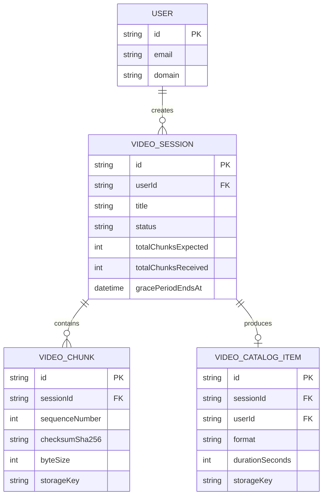
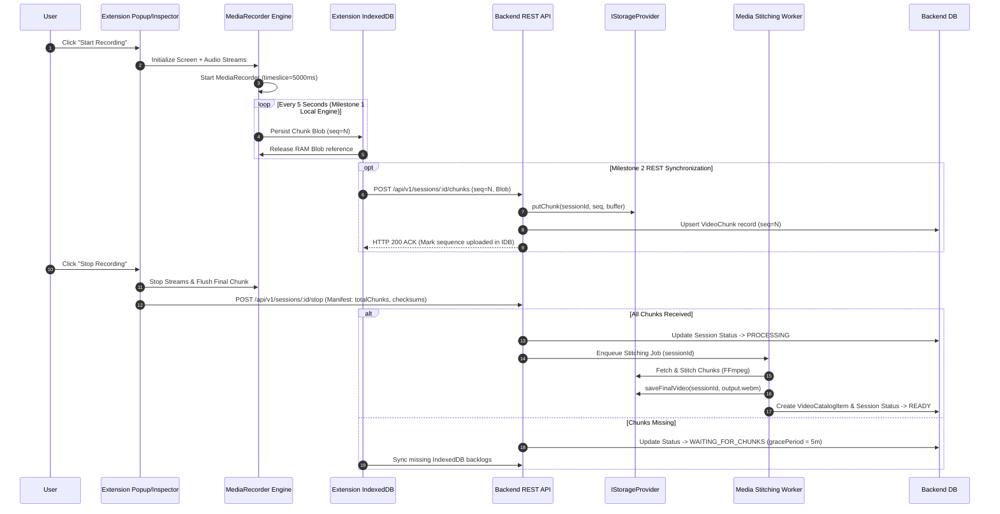
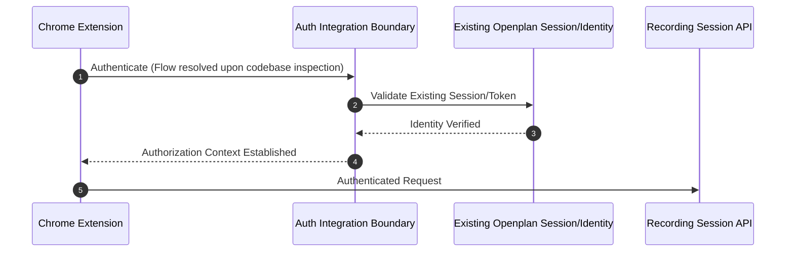

# ARCHITECTURE.md — Single Source of Truth (SSOT) & Technical Blueprint

**Project:** Openplan Screen & Meeting Recorder  
**Version:** 1.1.0 — Architecture Specification & Blueprint  
**Status:** Approved Blueprint (Provisional Codebase Integration Points)  
**Classification:** Internal Architectural Specification  

---

## SECTION 0 — SINGLE SOURCE OF TRUTH (SSOT)

This section serves as the definitive reference for all system design and AI-assisted code generation. Every file added to this repository MUST strictly comply with the definitions, rules, and contracts specified below.

### 0.1 Tech Stack Specification & Discovery Status
- **Chrome Extension Target**: Google Chrome Manifest V3, WebRTC Media APIs, IndexedDB (`idb` v8.x), React (`v18.3.x`), Vite (`v5.2.x`), Tailwind CSS (`v3.4.x`).
- **Openplan Backend Target (PROVISIONAL)**: Candidate stack Node.js / Express / Prisma ORM / PostgreSQL. *Status: Provisional until existing Openplan repository is inspected. The recording backend module will integrate into or match the existing backend stack.*
- **Openplan Web Dashboard Target (PROVISIONAL)**: Candidate stack Next.js App Router / React. *Status: Provisional until existing Openplan frontend is inspected. If the existing Openplan web app exists, the video player/catalog will be integrated directly into it as a domain module rather than building a duplicate standalone application.*
- **Processing Engine**: FFmpeg (`v6.1.x` CLI binary wrapper).
- **Testing Frameworks**: Vitest (`v1.5.x`), Playwright (`v1.43.x`) for Extension & Web E2E.

---

### 0.2 Module Boundaries & Import Rules

#### Frontend Workspace Boundaries (`/apps`, `/packages`)
1. `apps/chrome-extension`: Manifest V3 extension containing recording runtime, offscreen audio processor, IndexedDB offline cache manager, and Milestone 1 local verification inspector.
2. `packages/contracts`: Shared TypeScript DTOs, API request/response envelopes, payload validation schemas (Zod `v3.23.x`), and domain event definitions.
3. `packages/core`: Shared cross-cutting frontend utilities (logger, fetch client wrapper, time/format helpers, WebRTC stream hooks).
4. `Openplan Web Dashboard`: Integrated domain module inside the existing Openplan web application (or fallback `apps/openplan-web` if proven necessary post-inspection).

**Strict Import Rule**: `apps/chrome-extension` MUST NEVER import directly from web frontend internal modules. They interact strictly via `@openplan/contracts` and `@openplan/core`.

#### Backend Modular Monolith Structure (`apps/backend/src` or target domain modules)
1. `modules/auth`: Boundary for session validation and Openplan identity integration.
2. `modules/recording-session`: Session creation, 5s chunk ingestion REST endpoints, sequence tracking, missing-chunk manifest validation, session state machine.
3. `modules/media-processing`: FFmpeg stitching orchestration, processing queue worker, video format validation, transcoding pipeline.
4. `modules/video-catalog`: Metadata indexing, signed playback URL generation, domain access authorization, retention lifecycle management.
5. `core/`: Shared infrastructure — database client, logging (Pino), abstract storage provider interface (`IStorageProvider`), abstract job queue interface (`IJobQueue`), cross-cutting auth middleware, error handlers.

---

### 0.3 Core Domain Shared Entities (TypeScript Interfaces)

```typescript
// packages/contracts/src/entities.ts

export type SessionStatus = 
  | 'INITIALIZED' 
  | 'RECORDING' 
  | 'STOPPED' 
  | 'WAITING_FOR_CHUNKS' 
  | 'PROCESSING' 
  | 'READY' 
  | 'FAILED' 
  | 'INCOMPLETE';

export interface VideoSession {
  id: string; // UUIDv4
  userId: string; // Openplan User ID
  title: string;
  sourceTabUrl?: string;
  status: SessionStatus;
  totalChunksExpected?: number;
  totalChunksReceived: number;
  durationSeconds?: number;
  fileSizeBytes?: number;
  gracePeriodEndsAt?: string; // ISO 8601
  createdAt: string;
  updatedAt: string;
}

export interface VideoChunk {
  id: string; // UUIDv4
  sessionId: string;
  sequenceNumber: number;
  checksumSha256: string;
  byteSize: number;
  storageKey: string;
  uploadedAt: string;
}

export interface SessionManifest {
  sessionId: string;
  totalChunks: number;
  sequenceChecksums: Record<number, string>; // sequenceNumber -> sha256
  finalChunkTimestamp: string;
}

export interface FinalVideoAsset {
  id: string;
  sessionId: string;
  title: string;
  format: 'webm' | 'mp4';
  durationSeconds: number;
  byteSize: number;
  storageKey: string;
  thumbnailKey?: string;
  expiresAt: string;
  createdAt: string;
}
```

---

### 0.4 API Contract Format (Request / Response Envelopes)

All REST API endpoints MUST return responses wrapped in standard JSON envelopes. Detailed endpoint behavior, state transitions, edge cases, test cases, and binary acceptance criteria belong in dedicated Feature Specs.

```typescript
// Standard Success Response Envelope
export interface ApiResponse<T> {
  success: true;
  data: T;
  meta?: {
    timestamp: string;
    requestId: string;
  };
}

// Standard Error Response Envelope
export interface ApiErrorResponse {
  success: false;
  error: {
    code: string; // e.g. "ERR_CHUNK_OUT_OF_SEQUENCE", "ERR_SESSION_NOT_FOUND"
    message: string;
    details?: Record<string, unknown>;
  };
  meta: {
    timestamp: string;
    requestId: string;
  };
}
```

---

### 0.5 Environment Variable Schema

```typescript
// apps/backend/src/core/config/env.schema.ts
export interface EnvironmentVariables {
  NODE_ENV: 'development' | 'test' | 'production';
  PORT: number; // e.g. 4000
  DATABASE_URL: string;
  OPENPLAN_AUTH_JWT_SECRET: string;
  CORS_ALLOWED_ORIGINS: string; // Configured explicit origins (e.g. chrome-extension://<id>, https://<configured-domain>)
  
  // Pluggable Infrastructure Configs (Vendor Uncommitted)
  STORAGE_PROVIDER_TYPE: 'local' | 'vendor-adapter';
  STORAGE_LOCAL_DIR?: string; // Path for local dev storage
  
  JOB_QUEUE_TYPE: 'in-memory' | 'db-polling' | 'vendor-adapter';
  
  MAX_CHUNK_SIZE_BYTES: number; // Configurable safety threshold (validated during Milestone 1 telemetry)
  SESSION_GRACE_PERIOD_MINUTES: number; // Default 5
}
```

---

### 0.6 Code Rules & Generation Checklist

Every file created in this repository must comply with:
- [ ] **Strict Typing**: No explicit or implicit `any`. Use `unknown` or specific interfaces.
- [ ] **Kebab-Case File Names**: e.g., `recording-session.service.ts`, `chunk-uploader.ts`.
- [ ] **PascalCase React Components**: e.g., `LocalInspectorPlayer.tsx`.
- [ ] **Explicit Boundaries**: No direct imports across frontend client apps or backend domain modules.
- [ ] **Snippet Constraint**: Configuration and code examples strictly under 20 lines.

---

## SECTION 1 — UI & FRONTEND ARCHITECTURE

### 1.1 Architecture & Monorepo Workspace Layout
The repository is structured around a standalone Chrome Extension workspace and shared contracts, with web dashboard integration deferred until existing code inspection.

```
/
├── apps/
│   ├── chrome-extension/              # Client Target 1 (MV3 Extension - Milestone 1)
│   │   ├── manifest.json
│   │   ├── src/
│   │   │   ├── background/            # MV3 Service Worker & Tab Monitor
│   │   │   │   └── service-worker.ts
│   │   │   ├── content/               # DOM/Meet event detection + F-005 floating widget
│   │   │   │   ├── meet-detector.ts
│   │   │   │   └── recording-widget.tsx
│   │   │   ├── popup/                 # Primary Extension Popup UI
│   │   │   │   └── PopupApp.tsx
│   │   │   ├── inspector/             # Milestone 1 Local Inspector Player
│   │   │   │   └── LocalInspector.tsx
│   │   │   └── modules/               # Internal MV3 Modules
│   │   │       ├── recorder/          # WebRTC MediaRecorder engine
│   │   │       │   ├── recorder.service.ts
│   │   │       │   └── audio-mixer.ts
│   │   │       └── offline-cache/     # IndexedDB 5-sec blob store
│   │   │           ├── idb-store.ts
│   │   │           └── sync-worker.ts
├── packages/
│   ├── contracts/                     # Shared DTOs, Schemas, API Types
│   └── core/                          # Shared Utils, WebRTC helpers
```

### 1.2 Milestone 1 Local Inspector & Memory Target
- **Performance Target**: Sustained extension memory usage below 300MB during normal recording, validated through active profiling. *(Releasing Blob array references to garbage collection enables low RAM usage; browser-wide total memory bounds are subject to engine profiling).*
- **Inspector Tooling Isolation**: The Local Inspector/Player (`LocalInspector.tsx`) is a developer verification tool for Milestone 1. Concatenating stored chunks into a single large local `Blob` for playback is an isolated verification operation and is separate from the streaming recording engine's low-RAM chunking pipeline.

---

## SECTION 2 — BACKEND & SYSTEM ARCHITECTURE

### 2.1 Backend Modular Layout (`apps/backend/src`)
```
apps/backend/src/
├── core/                              # Infrastructure & Core Services
│   ├── database/                      # DB ORM setup (Provisional)
│   ├── logger/                        # Pino Logger wrapper
│   ├── middleware/                    # Auth boundary, CORS, Error Envelope
│   ├── storage/                       # Vendor-Neutral Storage Interface
│   │   ├── storage.interface.ts
│   │   └── local-storage.adapter.ts
│   └── queue/                         # Generic Job Queue Interface
│       ├── queue.interface.ts
│       └── async-queue.adapter.ts
├── modules/
│   ├── auth/                          # Authentication Boundary (Unlocked for Inspection)
│   │   ├── auth.controller.ts
│   │   └── auth.service.ts
│   ├── recording-session/             # Session Lifecycle & REST Chunk Ingestion
│   │   ├── session.controller.ts
│   │   ├── session.service.ts
│   │   └── session-state.machine.ts
│   ├── media-processing/              # FFmpeg Stitching Engine
│   │   ├── stitching.service.ts
│   │   └── stitching.worker.ts
│   └── video-catalog/                 # Video Management & Playback
│       ├── catalog.controller.ts
│       └── catalog.service.ts
└── app.ts                             # Monolith Bootstrapper
```

### 2.2 Generic Infrastructure Interfaces (Vendor-Neutral)

```typescript
// apps/backend/src/core/storage/storage.interface.ts
export interface IStorageProvider {
  putChunk(sessionId: string, sequenceNumber: number, data: Buffer): Promise<string>;
  getChunk(storageKey: string): Promise<Buffer>;
  saveFinalVideo(sessionId: string, videoBuffer: Buffer, format: string): Promise<string>;
  getSignedPlaybackUrl(storageKey: string, expiresInSeconds: number): Promise<string>;
}

// apps/backend/src/core/queue/queue.interface.ts
export interface JobTask<T = unknown> {
  id: string;
  name: string;
  payload: T;
}

export interface IJobQueue {
  enqueueJob<T>(jobName: string, payload: T): Promise<void>;
  registerWorker<T>(jobName: string, handler: (payload: T) => Promise<void>): void;
}
```

### 2.3 Database Schema (Provisional TypeScript Entity Mapping)

```typescript
export interface DbUser {
  id: string; // Primary Key
  email: string;
  domain: string;
  createdAt: Date;
}

export interface DbVideoSession {
  id: string;
  userId: string;
  title: string;
  status: 'INITIALIZED' | 'RECORDING' | 'STOPPED' | 'WAITING_FOR_CHUNKS' | 'PROCESSING' | 'READY' | 'FAILED' | 'INCOMPLETE';
  totalChunksExpected: number | null;
  totalChunksReceived: number;
  gracePeriodEndsAt: Date | null;
  createdAt: Date;
  updatedAt: Date;
}

export interface DbVideoChunk {
  id: string;
  sessionId: string;
  sequenceNumber: number;
  checksumSha256: string;
  byteSize: number;
  storageKey: string;
  createdAt: Date;
}

export interface DbVideoCatalogItem {
  id: string;
  sessionId: string;
  userId: string;
  title: string;
  format: string;
  durationSeconds: number;
  byteSize: number;
  storageKey: string;
  createdAt: Date;
}
```

### 2.4 Entity-Relationship (ER) Diagram



### 2.5 End-to-End System Flow Diagram



---

## SECTION 3 — INTEGRATION BOUNDARIES & API OVERVIEW

Detailed endpoint specifications, complete state machine transition tables, edge cases, and test acceptance criteria belong in dedicated Feature Specs. Below is the architectural overview of key contract interfaces.

### 3.1 REST API Overview

#### 1. Initialize Recording Session
- **Endpoint**: `POST /api/v1/sessions/init`
- **Request Payload**: `{ title: string, sourceTabUrl?: string }`
- **Response**: `ApiResponse<{ sessionId: string, status: 'INITIALIZED' }>`

#### 2. Upload Recording Chunk (Idempotent Ingestion)
- **Endpoint**: `POST /api/v1/sessions/:sessionId/chunks`
- **Payload**: `multipart/form-data` (`sequenceNumber`, `checksumSha256`, `chunk` binary)
- **Response**: `ApiResponse<{ sessionId: string, sequenceNumber: number, status: 'ACKNOWLEDGED' }>`

#### 3. Stop & Finalize Session Handshake
- **Endpoint**: `POST /api/v1/sessions/:sessionId/stop`
- **Request Payload**: `SessionManifest` (`{ totalChunks: number, sequenceChecksums: Record<number, string> }`)
- **Response**: `ApiResponse<{ sessionId: string, status: 'PROCESSING' | 'WAITING_FOR_CHUNKS', missingSequences: number[] }>`

---

## SECTION 4 — SECURITY & AUTHENTICATION BOUNDARY

### 4.1 Security Specifications
- **Origin Security**: CORS origins are loaded from environment configuration. Wildcards (`*`) with credentials are prohibited.
- **Domain-Restricted Access**: Playback URLs are authorized as temporary signed URLs valid only within configured domain permissions.
- **Configurable Chunk Safety Limit**: Chunk sizes are checked against `MAX_CHUNK_SIZE_BYTES` safety threshold (configured based on 720p MediaRecorder bitrate profiling).

### 4.2 Authentication Integration Boundary Diagram



---

## SECTION 5 — TESTING STRATEGY & PHASED ROADMAP

> [!IMPORTANT]
> **Strict Phased Milestone Guarantee**: Milestone 1 is completely independent. It DOES NOT depend on backend, database, cloud storage, authentication, queue infrastructure, FFmpeg, or Openplan web dashboard.

### 5.1 Phased Implementation Milestones
- **Milestone 1 (Local-First Extension Recorder)**: Full local offline recording pipeline: Chrome Screen/Audio/Mic capture → 5s chunking → IndexedDB persistence → Local Inspector Player & WebM Export → Memory cleanup. *100% offline & local.*
- **Milestone 2 (Backend REST & Storage Integration)**: REST chunk ingestion, idempotent deduplication, `IStorageProvider` local filesystem adapter, session manifest verification.
- **Milestone 3 (Media Processing Queue & FFmpeg)**: Generic `IJobQueue` worker, FFmpeg stitching pipeline, error recovery, missing chunk handling.
- **Milestone 4 (Openplan Video Catalog & Web Viewer)**: Video catalog dashboard integration into existing Openplan web app, signed URL playback, RBAC, domain restriction enforcement.

### 5.2 Quality Targets
- **Unit & Integration Test Coverage**: ≥ 85% core modules (`recorder.service`, `idb-store`).
- **Memory Performance Target**: Sustained extension memory usage below 300MB during normal recording, validated through profiling.
