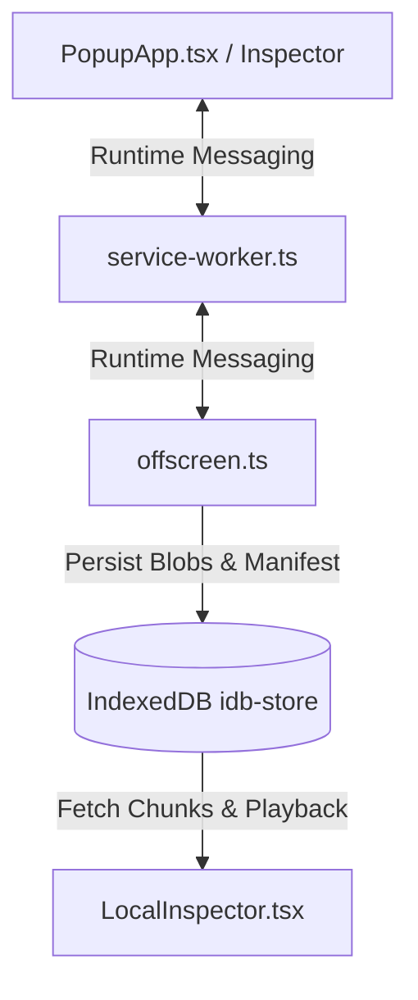
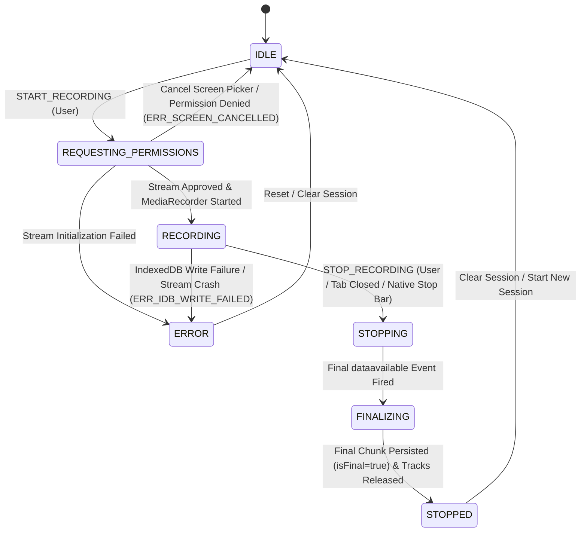

# FEATURE-SPEC-F-001 — Local-First Chrome Extension Recording Engine (Milestone 1)

---

### Section 1 — Feature Summary

```text
Feature ID:    F-001
Feature name:  Local-First Chrome Extension Recording Engine
Priority:      P0
Sprint:        Sprint 1 (Milestone 1)
Size estimate: L
Spec version:  1.1
Last updated:  2026-08-14
```

This feature implements the complete local-first recording engine inside a Chrome Extension (Manifest V3) for **Milestone 1**. It enables a user to capture screen, system audio, and microphone inputs without any backend, cloud storage, external dependencies, or authentication requirements. Recorded media is processed in real time into 5-second WebM chunks via an MV3 Offscreen Document (`src/offscreen/offscreen.ts`), persisted into IndexedDB with 1-indexed sequence tracking, and unreferenced from active recording memory to prevent unbounded RAM growth. The feature includes a standalone Local Inspector/Player for verifying chunk continuity, playing combined streams, downloading complete WebM files, and performing manual session cleanup. It also monitors Google Meet tab lifecycles to trigger automatic, graceful session finalization.

---

### Section 2 — Actors and Permissions

Since Milestone 1 operates entirely offline and locally within the user's Chrome browser, permissions apply to local Extension capabilities and browser Media Devices rather than backend RBAC.

| Action / Capability | Authenticated User | Unauthenticated / Local User | Non-Chrome Browser |
|---------------------|-------------------|-----------------------------|-------------------|
| Initiate Screen Capture | ✅ | ✅ | ❌ (Unsupported) |
| Request Microphone Stream | ✅ | ✅ | ❌ |
| Store Chunks in IndexedDB | ✅ | ✅ | ❌ |
| Launch Local Inspector / Player | ✅ | ✅ | ❌ |
| Export Consolidated WebM | ✅ | ✅ | ❌ |
| Delete Local Recording Session | ✅ | ✅ | ❌ |

#### Browser Permissions & Error Mapping

`navigator.mediaDevices.getDisplayMedia()` is the primary WebRTC screen capture API for recording screen and system audio.

| Capability | Chrome API / Constraint | Error Code on Denial | Behavior / Response |
|------------|------------------------|----------------------|---------------------|
| Screen Share Picker | `navigator.mediaDevices.getDisplayMedia` | `ERR_SCREEN_CANCELLED` | Cancels initialization, cleans resources, returns session state to `IDLE` with warning banner. |
| Microphone Permission | `navigator.mediaDevices.getUserMedia` | `ERR_MIC_DENIED` | Gracefully degrades to system-audio only (or video-only if system audio absent); displays audio warning banner. |
| IndexedDB Write | `indexedDB` quota / disk space | `ERR_IDB_WRITE_FAILED` | Recording stops immediately, transitions session state to `ERROR`, displays storage error notification. |

---

### Section 3 — API & Execution Contract

In Milestone 1, communication is local and asynchronous across MV3 execution contexts (`PopupApp.tsx`, `service-worker.ts`, `offscreen.ts`, `LocalInspector.tsx`) using Chrome Runtime Messaging (`chrome.runtime.sendMessage`). All messages strictly follow the SSOT envelope format adapted for internal message channels and local IndexedDB interfaces.

#### 3.1 Chrome Extension Context Architecture & Responsibilities



- **`service-worker.ts`**: Service Worker / Control layer. Tracks session state, monitors Meet tabs (`chrome.tabs`), spawns/manages offscreen document, relays control messages. Reconstructs/reconciles active state from IndexedDB upon wake-up. Performs ZERO DOM/Audio/MediaRecorder calls.
- **`offscreen.ts`**: Offscreen Document runtime container (`src/offscreen/offscreen.html` + `src/offscreen/offscreen.ts`). Holds WebRTC stream graph, audio mixer, `MediaRecorder` instance (5s timeslice), writes chunks directly to IndexedDB, flushes final chunks.
- **`PopupApp.tsx`**: Lightweight control UI. Sends start/stop commands, displays state badge, links to Local Inspector.
- **`LocalInspector.tsx`**: Local verification UI. Reads IndexedDB sessions/chunks, verifies sequence continuity, renders HTML5 video player, executes WebM export/download, performs session deletion.

#### 3.2 Internal Extension Message Contract

All messages between contexts use a typed envelope:

```typescript
export interface ExtensionMessage<T = unknown> {
  target: 'SERVICE_WORKER' | 'OFFSCREEN' | 'POPUP' | 'INSPECTOR';
  action: string;
  payload: T;
  meta: {
    timestamp: string;
    requestId: string;
  };
}
```

##### 1. Command: `START_RECORDING`
- **Sender**: `PopupApp.tsx` → `service-worker.ts` → `offscreen.ts`
- **Request Payload**: `{ title: string, sourceTabUrl?: string }`
- **Success Response**: 
  ```json
  {
    "success": true,
    "data": {
      "sessionId": "550e8400-e29b-41d4-a716-446655440000",
      "status": "RECORDING",
      "captureMode": "SCREEN_SYSTEM_MIC"
    }
  }
  ```
- **Error Responses**:
  - `ERR_SCREEN_CANCELLED`: Screen share picker dismissed by user. State returns to `IDLE`.
  - `ERR_OFFSCREEN_INIT_FAILED`: Failed to create MV3 offscreen document.

##### 2. Command: `STOP_RECORDING`
- **Sender**: `PopupApp.tsx` / `service-worker.ts` (Auto-stop) → `offscreen.ts`
- **Request Payload**: `{ sessionId: string, reason: 'USER_ACTION' | 'TAB_CLOSED' | 'NATIVE_STOP_BAR' }`
- **Success Response**:
  ```json
  {
    "success": true,
    "data": {
      "sessionId": "550e8400-e29b-41d4-a716-446655440000",
      "status": "STOPPED",
      "totalChunks": 12,
      "durationSeconds": 58.4
    }
  }
  ```

##### 3. Message: `RECORDING_STATE_CHANGED` (Event Broadcast)
- **Sender**: `service-worker.ts` → All UI listeners (`PopupApp`, `Inspector`)
- **Payload**:
  ```json
  {
    "sessionId": "550e8400-e29b-41d4-a716-446655440000",
    "status": "RECORDING",
    "chunksRecorded": 5,
    "activeCaptureMode": "SCREEN_SYSTEM_MIC"
  }
  ```

---

### Section 4 — State Machine

State tracking for local sessions must strictly follow this lifecycle.

#### 4.1 State Definitions

- **`IDLE`**: Default state. Engine ready, no active recording.
- **`REQUESTING_PERMISSIONS`**: User initiated start; extension is spawning offscreen document and prompting for display/mic capture via `getDisplayMedia`.
- **`RECORDING`**: MediaRecorder is actively running, producing ~5-second WebM chunks to IndexedDB.
- **`STOPPING`**: Stop signal received (user or auto-stop). MediaRecorder requested to stop; awaiting final `dataavailable` event.
- **`FINALIZING`**: Final chunk written to IndexedDB with `isFinal = true`. Media tracks stopped/released. Session metadata finalized.
- **`STOPPED`**: Recording complete. Data fully persisted in IndexedDB. Ready for inspection, WebM export, or deletion.
- **`ERROR`**: Failure encountered (e.g. IndexedDB write failure, unrecoverable stream error). System resources freed.

#### 4.2 State Diagram



#### 4.3 Transition Table

| From | To | Trigger | Actor | Condition | Side Effects |
|------|----|---------|-------|-----------|--------------|
| `IDLE` | `REQUESTING_PERMISSIONS` | Click "Start Recording" | User | None | Spawns MV3 Offscreen Document, prompts for `getDisplayMedia`. |
| `REQUESTING_PERMISSIONS` | `IDLE` | Cancel Screen Picker | User | Screen picker cancelled | Destroys offscreen context, resets UI, shows cancellation banner. No session created. |
| `REQUESTING_PERMISSIONS` | `RECORDING` | Screen stream acquired | System | Valid stream obtained | Initializes audio graph, starts `MediaRecorder(5000)`, writes session header to IDB. |
| `RECORDING` | `STOPPING` | Click "Stop" / Tab Close / Native Bar | User / System | Stop requested | Calls `mediaRecorder.stop()`, waits for final `dataavailable` event. |
| `RECORDING` | `ERROR` | IDB Write Error / Quota | System | Quota exceeded or DB fail | Stops tracks, marks session as `ERROR`, emits notification. |
| `STOPPING` | `FINALIZING` | Final `dataavailable` fired | System | Blob received | Writes final partial chunk to IDB with `isFinal = true`. |
| `FINALIZING` | `STOPPED` | IDB transaction completes | System | Writes committed | Releases `MediaStream` tracks, updates session status to `STOPPED`, broadcasts update. |

---

### Section 5 — Happy Path Flow

Step-by-step flow for initiating, chunking, auto-stopping, inspecting, and exporting a local recording.

```text
1. User clicks Chrome Extension Icon
   → Popup UI (PopupApp.tsx) renders in IDLE state.

2. User clicks "Start Recording"
   → PopupApp sends START_RECORDING command to service-worker.ts.
   → service-worker.ts transitions state to REQUESTING_PERMISSIONS and creates MV3 Offscreen Document.
   → offscreen.ts calls navigator.mediaDevices.getDisplayMedia and navigator.mediaDevices.getUserMedia.

3. User selects Screen / Window and checks "Share audio", approves Microphone
   → Audio mixer combines System Audio + Microphone tracks into a single MediaStream.
   → offscreen.ts initializes new VideoSession record in IndexedDB (status: RECORDING).
   → offscreen.ts calls MediaRecorder.start(5000). State transitions to RECORDING.

4. Recording Loop (Every 5 seconds)
   → MediaRecorder emits dataavailable event with ~5-second WebM Blob chunk.
   → offscreen.ts writes chunk record to IndexedDB with sequenceNumber = N (1-indexed).
   → Blob reference in active JavaScript memory is unreferenced, allowing browser Garbage Collection.

5. User clicks "Stop Recording" in Popup (or clicks Chrome native "Stop sharing" bar)
   → service-worker.ts receives stop signal and forwards to offscreen.ts.
   → Session state transitions RECORDING → STOPPING.
   → offscreen.ts executes MediaRecorder.stop().

6. Final Chunk & Resource Cleanup
   → MediaRecorder fires final dataavailable event containing final partial WebM blob.
   → offscreen.ts writes chunk with isFinal = true and sequenceNumber = N_final to IndexedDB.
   → Session state transitions STOPPING → FINALIZING.
   → offscreen.ts stops all MediaStream audio/video tracks.
   → Session metadata in IndexedDB updated: status = STOPPED, totalChunks = N_final, durationSeconds = calculated.
   → service-worker.ts closes Offscreen Document. Popup UI displays "Recording Completed" with Inspector/Export buttons.

7. User clicks "Open Local Inspector"
   → Inspector tab opens (LocalInspector.tsx).
   → Inspector fetches session metadata and chunks sorted by 1-indexed sequenceNumber from IndexedDB.
   → Inspector verifies sequence completeness (1..N).
   → Inspector concatenates Blobs into single Blob URL for HTML5 player preview.

8. User clicks "Export WebM"
   → Inspector triggers browser file download for recording-[sessionId].webm.
   → Session records remain safely in IndexedDB until user explicitly clicks "Delete Recording".
```

---

### Section 6 — Edge Case Table

| # | Scenario | Actor | Precondition | Expected Behaviour | Status / Error Code |
|---|----------|-------|--------------|-------------------|--------------------|
| E-01 | User cancels Chrome screen share picker | User | Picker displayed | Clean up partial offscreen context, return to `IDLE`, show info toast. No session saved in IDB. | `ERR_SCREEN_CANCELLED` |
| E-02 | Microphone permission denied | User | Mic prompt shown | Show warning toast "Mic not enabled", proceed with Screen + System Audio capture. | Success (Degraded) |
| E-03 | User unchecks "Share audio" in display picker | User | Screen picker active | Proceed with Screen + Microphone capture only. Do NOT synthesize fake silent audio tracks. | Success (Degraded) |
| E-04 | Both Mic and System Audio unavailable | System | Device missing/denied | Proceed with Video-only recording without throwing audio exceptions. | Success (Degraded) |
| E-05 | User clicks native Chrome floating "Stop sharing" bar | User | Recording active | `MediaStreamTrack.onended` detected. Execute full `STOPPING` → `FINALIZING` → `STOPPED` pipeline cleanly. | Success |
| E-06 | Monitored Google Meet tab is closed or navigated away | System | Meet tab actively recorded | Service worker detects tab close via `chrome.tabs.onRemoved`/`onUpdated`, sends `STOP_RECORDING` to offscreen. | Success (Auto-stopped) |
| E-07 | IndexedDB storage quota exceeded or write fails | System | IDB write attempted | `MediaRecorder` stopped immediately, stream tracks killed, session status marked `ERROR`, UI displays error dialog. | `ERR_IDB_WRITE_FAILED` |
| E-08 | Local Inspector detects missing sequence gap (e.g. chunks 1, 2, 4) | User | Inspector opened | Inspector displays warning: "Recording incomplete: Missing chunk 3". Export button disabled/warned. | `ERR_SEQUENCE_GAP` |
| E-09 | Extension Service Worker suspended or restarted mid-recording | Browser / System | Recording active in Offscreen Document | Offscreen Document + IndexedDB continue active recording independently. Upon SW wake-up, SW reconciles session state from persistent IndexedDB store rather than relying on SW memory. | Success |
| E-10 | Final chunk duration is under 5 seconds (e.g. 1.2s) | System | Recording stopped early | Final chunk saved with exact partial Blob, marked `isFinal = true`, sequence number = `N_last`. | Success |

---

### Section 7 — Module Impact Map

```text
apps/chrome-extension/
├── manifest.json                                # [MODIFY] Add offscreen permission, storage, tabs
├── src/
│   ├── background/
│   │   └── service-worker.ts                    # [MODIFY] Implement session orchestration, Meet tab listener, MV3 offscreen launcher, SW state reconciliation
│   ├── offscreen/
│   │   ├── offscreen.html                       # [NEW] Offscreen document HTML container for WebRTC/MediaRecorder
│   │   └── offscreen.ts                         # [NEW] Offscreen recording runtime controller & IDB writer
│   ├── content/
│   │   └── meet-detector.ts                     # [NEW] Optional tab detection helper for meet.google.com
│   ├── popup/
│   │   └── PopupApp.tsx                         # [MODIFY] Render Milestone 1 control state, Start/Stop buttons, Inspector link
│   ├── inspector/
│   │   └── LocalInspector.tsx                   # [NEW] Milestone 1 Local Inspector player, Blob concatenator, WebM downloader
│   └── modules/
│       ├── recorder/
│       │   ├── recorder.service.ts              # [NEW] Offscreen WebRTC stream manager, MediaRecorder (5s timeslice)
│       │   └── audio-mixer.ts                   # [NEW] WebAudio API System + Mic track combiner & degraded fallback logic
│       └── offline-cache/
│           └── idb-store.ts                     # [NEW] IndexedDB wrapper using idb v8 for sessions & chunk blobs
packages/contracts/
├── src/
│   ├── entities.ts                              # [MODIFY] Update Milestone 1 Local Session & Chunk interfaces
│   └── messages.ts                              # [NEW] Extension internal runtime message contracts
```

#### Module Interactions

- **`service-worker.ts`** communicates with **`offscreen.ts`** using `chrome.runtime.sendMessage` and reconciles active recording state from IndexedDB upon wake-up.
- **`recorder.service.ts`** (inside offscreen) invokes **`audio-mixer.ts`** to build the composite audio stream before starting `MediaRecorder`.
- **`recorder.service.ts`** writes chunk data directly to **`idb-store.ts`** on each `dataavailable` event.
- **`LocalInspector.tsx`** reads strictly from **`idb-store.ts`**; it does not communicate directly with the active recorder runtime.

---

### Section 8 — Schema & Type Definitions

#### 8.1 IndexedDB Local Store Schema (`idb-store.ts`)

Database Name: `openplan_recorder_db`  
Database Version: `1`

##### Object Store 1: `sessions`
- Primary Key: `sessionId` (string, UUIDv4)
- Indexes: `createdAt`, `status`

```typescript
export interface LocalVideoSession {
  sessionId: string;
  title: string;
  sourceTabUrl?: string;
  status: 'IDLE' | 'REQUESTING_PERMISSIONS' | 'RECORDING' | 'STOPPING' | 'FINALIZING' | 'STOPPED' | 'ERROR';
  captureMode: 'SCREEN_SYSTEM_MIC' | 'SCREEN_SYSTEM' | 'SCREEN_MIC' | 'SCREEN_ONLY';
  createdAt: string; // ISO 8601
  updatedAt: string; // ISO 8601
  totalChunks: number;
  durationSeconds?: number;
  fileSizeBytes?: number;
  errorMessage?: string;
}
```

##### Object Store 2: `chunks`
- Primary Key: `[sessionId, sequenceNumber]` (Compound Key)
- Indexes: `sessionId`, `sequenceNumber`

```typescript
export interface LocalVideoChunk {
  sessionId: string;
  sequenceNumber: number; // 1-indexed (1, 2, 3...)
  timestamp: string; // ISO 8601
  byteSize: number;
  mimeType: string; // e.g. "video/webm;codecs=vp8,opus"
  blob: Blob; // Raw binary chunk blob
  isFinal: boolean;
}
```

#### 8.2 Shared Extension Message Types (`packages/contracts/src/messages.ts`)

```typescript
export type ExtensionAction = 
  | 'START_RECORDING'
  | 'STOP_RECORDING'
  | 'GET_SESSION_STATUS'
  | 'RECORDING_STATE_CHANGED'
  | 'OFFSCREEN_ERROR';

export interface ExtensionMessage<T = unknown> {
  target: 'SERVICE_WORKER' | 'OFFSCREEN' | 'POPUP' | 'INSPECTOR';
  action: ExtensionAction;
  payload: T;
  meta: {
    timestamp: string;
    requestId: string;
  };
}
```

---

### Section 9 — Pre-Written Test Cases

#### 9.1 Unit Tests (Pure Logic / Mocked WebRTC & IDB)

```text
TEST: Audio Mixer Degraded Fallback Logic (audio-mixer.ts)
  Given: System Audio track present, Microphone track null (Permission Denied)
  When:  combineAudioTracks(systemStream, null) is called
  Expect: Returns MediaStream containing only system audio track. No error thrown, no dummy silent tracks added.

TEST: 1-Indexed Sequence Counter (recorder.service.ts)
  Given: MediaRecorder emitting 3 consecutive dataavailable events
  When:  Chunks are generated and passed to IDB store
  Expect: Sequence numbers assigned are strictly 1, 2, and 3 in exact order.

TEST: WebM Blob Re-assembly (LocalInspector.tsx)
  Given: 3 chunks stored in IDB with sequence numbers 1, 2, 3 and byte sizes 500KB, 500KB, 120KB
  When:  Inspector loads and concatenates chunks for playback
  Expect: Resulting concatenated Blob has type matching chunk mimeType and total byteSize equal to 1,120KB.
```

#### 9.2 Integration Tests (Offscreen + IndexedDB Integration)

```text
TEST: Full Local Chunk Persistence & Retention Verification
  Setup:   Mock MediaRecorder emitting 5s blobs in Offscreen Document context
  Request: Send START_RECORDING message -> run for 12 seconds -> send STOP_RECORDING message
  Expect:  IndexedDB session status transitions to STOPPED. Total 3 chunks persisted (seq 1, 2, 3). Chunk 3 has isFinal = true.
  DB Check: Verify 3 records exist in 'chunks' store for sessionId. Verify that active chunk array in offscreen memory maintains a fixed length (holding only active chunk) rather than accumulating past blobs in memory.
```

#### 9.3 End-to-End E2E Tests (Playwright Extension Testing)

```text
TEST: End-to-End Local Recording, Inspection, and WebM Export
  As:      Chrome Extension User
  Steps:   1. Click Extension Popup "Start Recording".
           2. Select screen share in test browser prompt.
           3. Record for 15 seconds.
           4. Click Extension Popup "Stop Recording".
           5. Click "Open Local Inspector".
           6. In Inspector, click "Export WebM".
  Expect:  Inspector displays video player preview. Clicking Export triggers browser file download recording-[id].webm.
```

---

### Section 10 — Acceptance Criteria

```text
[ ] AC-01: Given the extension popup is open, when the user clicks "Start Recording" and approves screen share, then an MV3 Offscreen document is spawned and recording begins within 2 seconds.

[ ] AC-02: Given active recording, when MediaRecorder runs, then WebM chunk blobs are generated every 5 seconds and persisted to IndexedDB with 1-indexed sequence numbers (1, 2, 3...).

[ ] AC-03: Given active recording, when microphone permission is denied, then recording continues successfully with Screen + System Audio (or video-only), and a UI warning banner is displayed.

[ ] AC-04: Given active recording, when the user clicks Chrome's native "Stop sharing" floating bar, then MediaStreamTrack.onended triggers graceful finalization (STOPPING → FINALIZING → STOPPED), saving the final partial chunk with isFinal = true.

[ ] AC-05: Given active recording on a Google Meet tab, when the Meet tab is closed or navigated away, then the extension service worker automatically detects tab removal and finalizes the recording session safely.

[ ] AC-06: Given a completed local recording in STOPPED state, when the user opens LocalInspector.tsx, then all chunks are loaded from IndexedDB, validated for sequence continuity, and combined into a playable HTML5 video preview.

[ ] AC-07: Given LocalInspector.tsx is displayed, when the user clicks "Export WebM", then the browser triggers a direct file download of the concatenated .webm file without deleting the IndexedDB source chunks.

[ ] AC-08: Given completed recordings in IndexedDB, when the user explicitly clicks "Delete Recording" in LocalInspector.tsx, then the session metadata and all associated chunk blobs are permanently removed from IndexedDB.

[ ] AC-09: Given screen capture picker is cancelled by the user, then the engine cleanly aborts initialization, creates zero IndexedDB records, and resets the UI state to IDLE.

[ ] AC-10: Given an active recording session, extension memory consumption validated during performance profiling demonstrates flat, bounded RAM usage (target < 300MB) without unbounded growth caused by retained Blob references in the recording pipeline.
```

---

### Section 11 — Out of Scope

```text
OUT OF SCOPE — Feature F-001 (Milestone 1)

The following items are explicitly EXCLUDED from Milestone 1:
  - Backend Chunk Upload & REST APIs: Deferred to Milestone 2.
  - Authentication & Openplan User Session Integration: Deferred to Milestone 2.
  - Cloud Storage (S3 / Railway): Deferred to Milestone 2.
  - Server-side FFmpeg Video Stitching & Transcoding: Deferred to Milestone 3.
  - Pause / Resume Recording Controls: Not required by PRD; deferred to future versions.
  - Video Trimming or In-Browser Editing: Explicit non-goal per PRD Section 3.3.
  - Non-Chrome Browser Support: Explicit non-goal per PRD Section 3.3.
```

---

### Section 12 — Dependencies

| Dependency | Type | Status | Reason Needed |
|------------|------|--------|---------------|
| Chrome Extension Manifest V3 setup | Extension Infrastructure | ✅ Ready | Base extension folder structure |
| `idb` v8.x package | Library | ✅ Available | Promisified IndexedDB wrapper |
| React v18 + Vite build target | Tooling | ✅ Ready | Building popup & inspector UIs |
