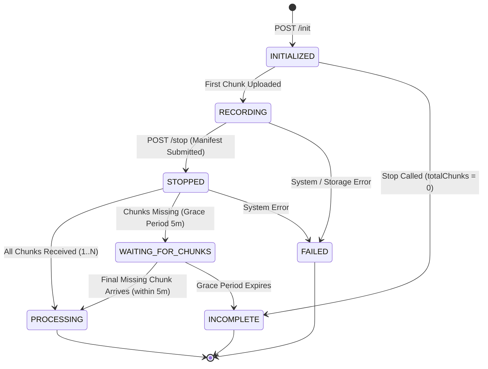

# FEATURE-SPEC-F-002 — Resilient Chunking & Ingestion Engine (Milestone 2)

---

### Section 1 — Feature Summary

```text
Feature ID:    F-002
Feature name:  Resilient Chunking & Ingestion Engine
Priority:      P0
Sprint:        Sprint 2 (Milestone 2)
Size estimate: L
Spec version:  1.0
Last updated:  2026-08-18
Related PRD:   PRD.md Section 8 (Feature F-002 & F-003), Section 9 (UF-001)
Related SSOT:  ARCHITECTURE.md Sections 0.3, 0.4, 0.5, 2.1, 2.2, 2.3, 3.1
Related Spec:  specs/FEATURE-SPEC-F-001-local-recording-engine.md
```

This feature implements the resilient chunk ingestion engine, extension background sync worker, and backend storage integration for **Milestone 2**. When a user starts a video call or opens a Google Meet session inside the OpenPlan AI web application, OpenPlan AI triggers recording automatically via Chrome Extension External Messaging (`chrome.runtime.sendMessage`). The extension captures screen, system audio, and microphone inputs (`SCREEN_SYSTEM_MIC`) and slices media into 5-second WebM chunks stored in IndexedDB (`openplan_recorder_db`). A dedicated background sync worker (`sync-worker.ts`) uploads pending chunks to the backend via `POST /api/v1/sessions/:sessionId/chunks` with a concurrency limit of 2, validating 64-character SHA-256 checksums and employing exponential backoff with jitter during network instability. The backend processes uploads idempotently, storing binary files using an atomic two-step write procedure (`chunk-XXXXXX.webm.tmp` → SHA-256 verification → `chunk-XXXXXX.webm`) managed by `LocalStorageAdapter`. Meeting completion is detected automatically via layered handlers (in-page DOM detection, tab unload/close listeners, navigation events, and native media track ended triggers). Upon meeting termination, the extension submits a final session manifest (`POST /api/v1/sessions/:sessionId/stop`). If all chunks are present, the session transitions to `PROCESSING`; if chunks are missing, it enters a 5-minute `WAITING_FOR_CHUNKS` grace period. Upon successful backend ACK, the extension sets `synced = true` and purges heavy binary blobs from IndexedDB while retaining lightweight audit metadata. No participant-facing stop, pause, or resume controls are exposed in the OpenPlan UI.

---

### Section 2 — Actors and Permissions

Authentication for Milestone 2 utilizes the mock development authentication boundary defined in ARCHITECTURE.md (`x-user-id: dev-user-1`). Permissions govern client origin authorization, role access, and backend API endpoints.

| Action / Capability | External OpenPlan Origin | Authenticated Member (`dev-user-1`) | Authenticated Admin | Unauthenticated / Invalid User |
|---------------------|--------------------------|-------------------------------------|---------------------|--------------------------------|
| Trigger Recording (`START_RECORDING`) | ✅ (Validated via `externally_connectable`) | ✅ | ✅ | ❌ (`ERR_UNAUTHORIZED_ORIGIN`) |
| Initialize Session (`POST /init`) | ❌ | ✅ | ✅ | ❌ (`HTTP 401 / ERR_UNAUTHENTICATED`) |
| Ingest Chunk (`POST /chunks`) | ❌ | ✅ | ✅ | ❌ (`HTTP 401 / ERR_UNAUTHENTICATED`) |
| Submit Stop Manifest (`POST /stop`) | ❌ | ✅ | ✅ | ❌ (`HTTP 401 / ERR_UNAUTHENTICATED`) |
| Read Session State | ❌ | ✅ (Owner only) | ✅ | ❌ (`HTTP 403 / ERR_INSUFFICIENT_PERMISSIONS`) |

#### Permission Verification & Error Codes

1. **Origin Verification**: External messages sent to `service-worker.ts` are validated against `externally_connectable.matches` in `manifest.json`. If the sender URL does not match permitted OpenPlan origins (e.g., `https://*.openplan.ai/*`), the extension rejects the message with error code `ERR_UNAUTHORIZED_ORIGIN`.
2. **Backend Authentication**: Every backend REST request must include the header `x-user-id`. If missing or blank, the backend returns `HTTP 401 Unauthorized` with `ERR_UNAUTHENTICATED`.
3. **Session Ownership**: A user (`x-user-id`) can only upload chunks or finalize sessions that belong to their user ID. Mismatches return `HTTP 403 Forbidden` with `ERR_INSUFFICIENT_PERMISSIONS`.

---

### Section 3 — API & Execution Contract

All REST API endpoints use JSON envelopes conforming strictly to ARCHITECTURE.md Section 0.4.

#### 3.1 External Web Messaging Contract (OpenPlan AI → Chrome Extension)

Target Context: `service-worker.ts` via `chrome.runtime.sendMessage(extensionId, message)`

```typescript
export interface ExternalStartRecordingMessage {
  target: 'SERVICE_WORKER';
  action: 'START_RECORDING';
  payload: {
    sessionId: string; // UUIDv4 generated by OpenPlan AI or client
    title: string;
    sourceTabUrl?: string;
  };
  meta: {
    timestamp: string;
    requestId: string;
  };
}
```

- **Success Response**:
  ```json
  {
    "success": true,
    "data": {
      "sessionId": "550e8400-e29b-41d4-a716-446655440000",
      "status": "RECORDING",
      "captureMode": "SCREEN_SYSTEM_MIC"
    }
  }
  ```
- **Error Responses**:
  - `ERR_UNAUTHORIZED_ORIGIN`: Message sent from an unapproved web origin.
  - `ERR_RECORDING_ALREADY_ACTIVE`: Active recording session is already running.

---

#### 3.2 Backend REST Endpoints

##### 1. Initialize Recording Session

```text
POST /api/v1/sessions/init
Auth:   x-user-id header required (e.g. dev-user-1)
Header: Content-Type: application/json
```

**Request Body**:
```json
{
  "sessionId": "550e8400-e29b-41d4-a716-446655440000",
  "title": "Weekly Engineering Sync",
  "sourceTabUrl": "https://meet.google.com/abc-defg-hij"
}
```

**Success Response (HTTP 200 OK or 201 Created)**:
```json
{
  "success": true,
  "data": {
    "sessionId": "550e8400-e29b-41d4-a716-446655440000",
    "userId": "dev-user-1",
    "title": "Weekly Engineering Sync",
    "status": "INITIALIZED",
    "createdAt": "2026-08-18T12:00:00.000Z"
  },
  "meta": {
    "timestamp": "2026-08-18T12:00:00.000Z",
    "requestId": "req-init-001"
  }
}
```

**Error Responses**:
- `HTTP 400` — `ERR_INVALID_PAYLOAD` — `sessionId` is not a valid UUIDv4 or `title` is missing.
- `HTTP 401` — `ERR_UNAUTHENTICATED` — Missing or empty `x-user-id` header.
- `HTTP 409` — `ERR_SESSION_ALREADY_EXISTS` — Session ID exists in terminal state (`PROCESSING`, `READY`, `FAILED`, `INCOMPLETE`). *Note: Re-initializing an active `INITIALIZED` or `RECORDING` session owned by the same user returns HTTP 200 OK idempotently.*

---

##### 2. Ingest Recording Chunk (Idempotent Multipart Upload)

```text
POST /api/v1/sessions/:sessionId/chunks
Auth:   x-user-id header required
Header: Content-Type: multipart/form-data
```

**Form Fields**:
- `sequenceNumber` (string / integer): 1-indexed chunk sequence ID (e.g. `"1"`).
- `checksumSha256` (string): Exactly 64 lowercase hexadecimal characters representing SHA-256 hash of binary WebM payload.
- `chunk` (file binary): WebM video payload (MIME type `video/webm`, max 10MB).

**Success Response (HTTP 200 OK)**:
```json
{
  "success": true,
  "data": {
    "sessionId": "550e8400-e29b-41d4-a716-446655440000",
    "sequenceNumber": 1,
    "byteSize": 524288,
    "checksumSha256": "e3b0c44298fc1c149afbf4c8996fb92427ae41e4649b934ca495991b7852b855",
    "status": "ACKNOWLEDGED",
    "isDuplicate": false
  },
  "meta": {
    "timestamp": "2026-08-18T12:00:05.000Z",
    "requestId": "req-chunk-001"
  }
}
```

**Idempotent Duplicate Response (HTTP 200 OK)**:
*Triggered when `(sessionId, sequenceNumber)` already exists with the exact same `checksumSha256`.*
```json
{
  "success": true,
  "data": {
    "sessionId": "550e8400-e29b-41d4-a716-446655440000",
    "sequenceNumber": 1,
    "byteSize": 524288,
    "checksumSha256": "e3b0c44298fc1c149afbf4c8996fb92427ae41e4649b934ca495991b7852b855",
    "status": "ACKNOWLEDGED",
    "isDuplicate": true
  },
  "meta": {
    "timestamp": "2026-08-18T12:00:06.000Z",
    "requestId": "req-chunk-dup"
  }
}
```

**Error Responses**:
- `HTTP 400` — `ERR_CHECKSUM_MISMATCH` — Backend recalculated SHA-256 does not match provided `checksumSha256`.
- `HTTP 400` — `ERR_CHUNK_SIZE_EXCEEDED` — Chunk binary exceeds 10MB (`MAX_CHUNK_SIZE_BYTES`).
- `HTTP 400` — `ERR_INVALID_MIME_TYPE` — Payload MIME type is not `video/webm`.
- `HTTP 404` — `ERR_SESSION_NOT_FOUND` — `sessionId` has not been initialized.
- `HTTP 409` — `ERR_DUPLICATE_SEQUENCE_CONFLICT` — Sequence number already exists with a *different* SHA-256 checksum. Data integrity violation; file is rejected without write.
- `HTTP 400` — `ERR_SESSION_EXPIRED` — Session grace period has expired and session is `INCOMPLETE` or `FAILED`.

---

##### 3. Stop & Finalize Recording Session

```text
POST /api/v1/sessions/:sessionId/stop
Auth:   x-user-id header required
Header: Content-Type: application/json
```

**Request Body**:
```json
{
  "totalChunks": 12,
  "sequenceChecksums": {
    "1": "e3b0c44298fc1c149afbf4c8996fb92427ae41e4649b934ca495991b7852b855",
    "2": "8431871a251a66736efd02a0a202c34a9b9a6789123456789abcdef012345678",
    "12": "a1b2c3d4e5f67890123456789abcdef0123456789abcdef0123456789abcdef0"
  },
  "finalChunkTimestamp": "2026-08-18T12:01:00.000Z"
}
```

**Success Response — All Chunks Present (HTTP 200 OK)**:
```json
{
  "success": true,
  "data": {
    "sessionId": "550e8400-e29b-41d4-a716-446655440000",
    "status": "PROCESSING",
    "totalChunksExpected": 12,
    "totalChunksReceived": 12,
    "missingSequences": []
  },
  "meta": {
    "timestamp": "2026-08-18T12:01:01.000Z",
    "requestId": "req-stop-001"
  }
}
```

**Success Response — Missing Chunks / Grace Period Started (HTTP 200 OK)**:
```json
{
  "success": true,
  "data": {
    "sessionId": "550e8400-e29b-41d4-a716-446655440000",
    "status": "WAITING_FOR_CHUNKS",
    "totalChunksExpected": 12,
    "totalChunksReceived": 10,
    "missingSequences": [3, 7],
    "gracePeriodEndsAt": "2026-08-18T12:06:01.000Z"
  },
  "meta": {
    "timestamp": "2026-08-18T12:01:01.000Z",
    "requestId": "req-stop-missing"
  }
}
```

**Response — Zero Chunks Handshake (HTTP 200 OK)**:
*If `totalChunks === 0`, session immediately transitions to `INCOMPLETE`.*
```json
{
  "success": true,
  "data": {
    "sessionId": "550e8400-e29b-41d4-a716-446655440000",
    "status": "INCOMPLETE",
    "totalChunksExpected": 0,
    "totalChunksReceived": 0,
    "missingSequences": []
  },
  "meta": {
    "timestamp": "2026-08-18T12:01:01.000Z",
    "requestId": "req-stop-zero"
  }
}
```

---

### Section 4 — State Machine

Every backend `VideoSession` entity strictly adheres to the state machine defined below.

#### 4.1 State Definitions

- **`INITIALIZED`**: Session registered via `POST /init`. Waiting for first chunk or active stream.
- **`RECORDING`**: Chunks actively arriving via `POST /chunks`.
- **`STOPPED`**: Stop signal received via `POST /stop`; manifest under validation.
- **`WAITING_FOR_CHUNKS`**: Manifest validated but sequence gaps remain (e.g. 1..12 expected, chunk 3 missing). 5-minute grace period active.
- **`PROCESSING`**: All expected chunks (1..N) received and SHA-256 verified. Session queued for stitching worker.
- **`INCOMPLETE`**: Grace period expired with missing chunks, or `totalChunks === 0`. Session retained as incomplete archive.
- **`FAILED`**: Unrecoverable system or storage failure.

#### 4.2 State Diagram



#### 4.3 Transition Table

| From | To | Trigger | Actor / Source | Condition | Side Effects & Error Codes |
|------|----|---------|----------------|-----------|----------------------------|
| `[*]` | `INITIALIZED` | `POST /init` | Client / OpenPlan | Valid `sessionId` & `title` | Creates `VideoSession` record in DB. |
| `INITIALIZED` | `RECORDING` | `POST /chunks` (seq=1) | Sync Worker | First valid chunk ingested | Updates `status = RECORDING`. |
| `INITIALIZED` | `INCOMPLETE` | `POST /stop` | Client | `totalChunks === 0` | Session marked `INCOMPLETE`. |
| `RECORDING` | `STOPPED` | `POST /stop` | Client | Manifest submitted | Validates received sequence numbers against expected manifest. |
| `STOPPED` | `PROCESSING` | Manifest check | System | All expected sequence IDs present | Enqueues stitching job; returns `status: PROCESSING`. |
| `STOPPED` | `WAITING_FOR_CHUNKS` | Manifest check | System | Sequence gaps present | Sets `gracePeriodEndsAt = now + 5m`; returns `missingSequences`. |
| `WAITING_FOR_CHUNKS` | `PROCESSING` | `POST /chunks` | Sync Worker | Final missing chunk uploaded within 5m | Cancels grace timer; transitions `status: PROCESSING`. |
| `WAITING_FOR_CHUNKS` | `INCOMPLETE` | Timer Expiration | Background Job | Grace period timer expires | Sets `status: INCOMPLETE`; late chunks return `ERR_SESSION_EXPIRED`. |
| Any | `FAILED` | Critical Failure | System | Storage crash / DB corruption | Marks `status: FAILED`; logs error. |

---

### Section 5 — Happy Path Flow

Step-by-step sequence for automatic meeting initiation, real-time chunking, background sync worker upload, atomic local storage write, layered auto-stop, manifest validation, and safe IndexedDB purging.

```text
1. User in OpenPlan AI clicks Video Call icon or opens Google Meet link
   → OpenPlan AI sends external message to Chrome Extension service worker:
     chrome.runtime.sendMessage(extensionId, { action: 'START_RECORDING', payload: { sessionId, title } })
   → service-worker.ts validates message origin against externally_connectable.matches.

2. Extension Initializes Recording Session
   → service-worker.ts sends POST /api/v1/sessions/init to backend with x-user-id: dev-user-1 and sessionId.
   → Backend creates VideoSession record in DB (status: INITIALIZED).
   → service-worker.ts spawns offscreen document container and starts WebRTC stream capture (SCREEN_SYSTEM_MIC).

3. Recording Engine & Real-Time Local Persistence (Every 5 seconds)
   → offscreen.ts MediaRecorder emits 5s WebM chunk blob.
   → offscreen.ts writes chunk record into IndexedDB openplan_recorder_db (sequenceNumber = N, synced = false).
   → offscreen.ts clears active Blob memory references to maintain RAM below 300MB.

4. Extension Sync Worker Real-Time Upload Loop (sync-worker.ts)
   → sync-worker.ts discovers unsynced IndexedDB chunks (synced = false / missing).
   → Executes POST /api/v1/sessions/:sessionId/chunks for up to 2 concurrent uploads.
   → Payload includes sequenceNumber, checksumSha256 (64-char hex), and binary WebM blob.

5. Backend Ingestion & Atomic Local Storage Write (LocalStorageAdapter)
   → Backend receives multipart chunk upload.
   → Recalculates SHA-256 hash from raw binary stream and verifies against checksumSha256.
   → LocalStorageAdapter writes file to STORAGE_LOCAL_DIR/sessions/:sessionId/chunk-XXXXXX.webm.tmp.
   → Verifies byte size and SHA-256 hash of written temp file.
   → Performs atomic file rename: chunk-XXXXXX.webm.tmp → chunk-XXXXXX.webm (6-digit zero-padded).
   → Backend creates DbVideoChunk record in DB and responds HTTP 200 OK (status: ACKNOWLEDGED).

6. Extension Safe IndexedDB Purge
   → Upon receiving HTTP 200 ACK, sync-worker.ts updates IndexedDB record:
     sets synced = true, removes binary blob (blob = undefined), retains lightweight metadata.
   → Audit trail remains in IndexedDB; blob RAM/disk space is freed.

7. Automatic Layered Meeting-End Detection
   → Meeting ends. Layered extension detectors fire:
     a) In-page DOM detector detects "You left the call" screen, OR
     b) Tab unload event triggers beforeunload content script listener, OR
     c) chrome.tabs.onRemoved / onUpdated detects tab closure/navigation, OR
     d) Native Chrome screen-sharing track ended event fires.
   → service-worker.ts sends STOP_RECORDING to offscreen document.

8. Final Chunk Flush & Manifest Submission
   → offscreen.ts flushes final partial WebM chunk (isFinal = true) into IndexedDB.
   → sync-worker.ts uploads final chunk to backend.
   → service-worker.ts sends POST /api/v1/sessions/:sessionId/stop with totalChunks and sequenceChecksums map.

9. Backend Finalization Check
   → Backend checks received sequence numbers (1..N).
   → All sequence numbers present and verified → VideoSession state transitions STOPPED → PROCESSING.
   → Backend queues session for media stitching pipeline.
```

---

### Section 6 — Edge Case Table

Exhaustive matrix of failure modes, invalid inputs, edge cases, and expected behaviors.

| # | Scenario | Actor | Precondition | Expected Behaviour | HTTP Code | Error Code |
|---|----------|-------|--------------|-------------------|-----------|------------|
| E-01 | Unauthorized web origin calls `START_RECORDING` | External Site | Message sent from unauthorized domain | Extension rejects message immediately; does not spawn offscreen context. | N/A | `ERR_UNAUTHORIZED_ORIGIN` |
| E-02 | `START_RECORDING` called when session already active | External / User | Session in `RECORDING` state | Extension ignores duplicate start; returns current active `sessionId`. | N/A | `ERR_RECORDING_ALREADY_ACTIVE` |
| E-03 | Microphone permission denied by user | User | Mic prompt presented | Extension degrades gracefully to `SCREEN_SYSTEM` mode; recording continues. | N/A | Success (Degraded) |
| E-04 | System audio unavailable | System | Display capture without system audio | Extension degrades to `SCREEN_MIC` or `SCREEN_ONLY`; recording continues. | N/A | Success (Degraded) |
| E-05 | Native Chrome "Stop sharing" floating bar clicked | User | Recording active | Track `onended` handler fires; triggers graceful stop & manifest submission. | N/A | Success |
| E-06 | Monitored Google Meet tab closed | User | Recording active | `chrome.tabs.onRemoved` fires; background script auto-stops recording cleanly. | N/A | Success |
| E-07 | Meet tab navigated to non-Meet URL | User | Recording active | `chrome.tabs.onUpdated` detects URL change; auto-stops recording cleanly. | N/A | Success |
| E-08 | Network connection lost mid-recording | System | Active recording | `sync-worker.ts` pauses network requests (`navigator.onLine === false`). Chunks persist safely in IndexedDB. | N/A | N/A (Paused) |
| E-09 | Network connection restored after drop | System | Multiple unsynced IDB chunks | `sync-worker.ts` resumes drain with max 2 concurrency, uploading pending chunks in sequence order. | 200 OK | Success |
| E-10 | Duplicate chunk upload with identical checksum | Sync Worker | Chunk already ingested | Backend returns HTTP 200 OK `ACKNOWLEDGED` with `isDuplicate: true`. Does NOT rewrite file. | 200 OK | Success |
| E-11 | Duplicate sequence upload with conflicting checksum | External / Attacker | Sequence N exists with different SHA-256 | Backend rejects upload immediately with HTTP 409 Conflict. Does NOT overwrite original file. | 409 Conflict | `ERR_DUPLICATE_SEQUENCE_CONFLICT` |
| E-12 | SHA-256 checksum mismatch | System / Network | Raw payload corrupted in transit | Backend recalculated hash differs from `checksumSha256`. Returns HTTP 400. File not written. | 400 Bad Request | `ERR_CHECKSUM_MISMATCH` |
| E-13 | Chunk file size exceeds 10MB | Client / Bug | Blob size > 10MB | Backend rejects upload before disk write. | 400 Bad Request | `ERR_CHUNK_SIZE_EXCEEDED` |
| E-14 | Invalid MIME type uploaded | Client | File MIME != `video/webm` | Backend rejects payload with HTTP 400. | 400 Bad Request | `ERR_INVALID_MIME_TYPE` |
| E-15 | Chunks uploaded out of order (e.g. seq 3 before seq 2) | Sync Worker | High concurrency / retry | Backend accepts chunk, writes to storage, and registers sequence number correctly. | 200 OK | Success |
| E-16 | Concurrent chunk uploads for same session | Sync Worker | 2 parallel upload requests | Backend handles parallel requests independently; DB unique constraints protect against race conditions. | 200 OK | Success |
| E-17 | Backend REST server unavailable (HTTP 503 / Offline) | System | Network / Server error | `sync-worker.ts` retries with exponential backoff + jitter (1s, 2s, 4s, 8s, 16s ±200ms) up to 5 attempts. | N/A | Retry Backoff |
| E-18 | IndexedDB purge fails after HTTP 200 ACK | Browser | Storage lock / IDB error | `synced = true` flag protects record. Sync worker skips re-upload on subsequent passes. | N/A | Warning Logged |
| E-19 | Disk write failure on backend (`STORAGE_LOCAL_DIR` full) | System | Disk space exhausted | Backend catches write error, cleans temp file (`.tmp`), returns HTTP 500. Sync worker retries. | 500 Internal Error | `ERR_STORAGE_WRITE_FAILED` |
| E-20 | `/stop` called before any chunks arrive | Client | Fast meeting open/close | Backend transitions `VideoSession` directly to `INCOMPLETE` state. | 200 OK | Success (`INCOMPLETE`) |
| E-21 | `/stop` called with missing sequence numbers | Client | Network drop during call | Backend updates session to `WAITING_FOR_CHUNKS`, returns `missingSequences`, starts 5m grace timer. | 200 OK | Success (`WAITING_FOR_CHUNKS`) |
| E-22 | Missing chunk arrives during 5m grace period | Sync Worker | Reconnected during grace period | Backend ingests chunk, checks sequence completeness. If complete, transitions to `PROCESSING`. | 200 OK | Success (`PROCESSING`) |
| E-23 | Missing chunk arrives after 5m grace period expires | Sync Worker | Reconnected after grace period | Backend returns HTTP 400 `ERR_SESSION_EXPIRED`. Session remains `INCOMPLETE`. | 400 Bad Request | `ERR_SESSION_EXPIRED` |
| E-24 | Repeated `/stop` request submitted | Client | Network retry / duplicate stop | Backend evaluates current session state idempotently and returns current status envelope. | 200 OK | Success |
| E-25 | Extension Service Worker suspended mid-recording | Browser | Chrome SW lifecycle idle | Offscreen document & IndexedDB continue recording independently. SW reconciles state from IDB on wake. | N/A | Success |
| E-26 | `POST /init` repeated for active session | Client | Re-initialization attempt | If session is `INITIALIZED` or `RECORDING` owned by same `x-user-id`, returns HTTP 200 OK idempotently. | 200 OK | Success |
| E-27 | Chunk upload attempted on session in `PROCESSING` | Sync Worker | Late chunk post-finalization | Backend rejects chunk with HTTP 400 `ERR_SESSION_ALREADY_FINALIZED`. | 400 Bad Request | `ERR_SESSION_ALREADY_FINALIZED` |
| E-28 | Chunk upload attempted on session in `INCOMPLETE` | Sync Worker | Late chunk post-expiration | Backend rejects chunk with HTTP 400 `ERR_SESSION_EXPIRED`. | 400 Bad Request | `ERR_SESSION_EXPIRED` |
| E-29 | Missing `x-user-id` header on API request | Client | Missing auth header | Backend rejects request immediately with HTTP 401 Unauthorized. | 401 Unauthorized | `ERR_UNAUTHENTICATED` |

---

### Section 7 — Module Impact Map

```text
apps/chrome-extension/
├── manifest.json                                # [MODIFY] Add externally_connectable permission for allowed OpenPlan origins
├── src/
│   ├── background/
│   │   └── service-worker.ts                    # [MODIFY] Add external message listener, handle POST /init, trigger sync-worker
│   ├── content/
│   │   └── meet-detector.ts                     # [MODIFY] Add in-page meeting-end DOM detection observers
│   └── modules/
│       └── offline-cache/
│           ├── idb-store.ts                     # [MODIFY] Add synced flag & blob purge support to LocalVideoChunk
│           └── sync-worker.ts                   # [NEW] Background sync worker (concurrency=2, retry backoff, safe purge)
packages/contracts/
├── src/
│   ├── api.ts                                   # [MODIFY] Define REST payload schemas for init, chunks, stop
│   ├── entities.ts                              # [MODIFY] Update VideoSession & LocalVideoChunk interfaces with synced flag
│   └── messages.ts                              # [MODIFY] Add ExternalStartRecordingMessage contract
apps/backend/
├── src/
│   ├── app.ts                                   # [MODIFY] Wire recording session router & storage provider
│   ├── core/
│   │   ├── config/env.schema.ts                 # [MODIFY] Add STORAGE_LOCAL_DIR, SESSION_GRACE_PERIOD_MINUTES
│   │   ├── middleware/auth.middleware.ts        # [NEW] Development auth boundary middleware checking x-user-id
│   │   └── storage/
│   │       ├── storage.interface.ts             # [NEW] IStorageProvider contract
│   │       └── local-storage.adapter.ts         # [NEW] LocalStorageAdapter (atomic write & SHA-256 verification)
│   └── modules/
│       └── recording-session/
│           ├── session.controller.ts            # [NEW] REST endpoints for /init, /chunks, /stop
│           ├── session.service.ts               # [NEW] Ingestion logic, sequence tracking, grace period handling
│           └── session-state.machine.ts         # [NEW] Session state machine transition validator
```

---

### Section 8 — Schema & Type Definitions

#### 8.1 Database Entity Schemas (Prisma / Backend Entity Definitions)

```typescript
// DbVideoSession entity mapping
export interface DbVideoSession {
  id: string; // Primary Key (UUIDv4)
  userId: string; // Openplan User ID (dev-user-1)
  title: string;
  sourceTabUrl: string | null;
  status: 'INITIALIZED' | 'RECORDING' | 'STOPPED' | 'WAITING_FOR_CHUNKS' | 'PROCESSING' | 'READY' | 'FAILED' | 'INCOMPLETE';
  totalChunksExpected: number | null;
  totalChunksReceived: number;
  gracePeriodEndsAt: Date | null;
  createdAt: Date;
  updatedAt: Date;
}

// DbVideoChunk entity mapping
export interface DbVideoChunk {
  id: string; // Primary Key (UUIDv4)
  sessionId: string; // Foreign Key -> DbVideoSession.id
  sequenceNumber: number; // 1-indexed (1, 2, 3...)
  checksumSha256: string; // 64-character lowercase hex string
  byteSize: number;
  storageKey: string; // Relative path in local storage
  createdAt: Date;
}
```

#### 8.2 Extension IndexedDB Schema Update (`idb-store.ts`)

Database Name: `openplan_recorder_db` | Version: `2`

##### Updated Store: `chunks`
- Primary Key: `[sessionId, sequenceNumber]` (Compound Key)
- Indexes: `sessionId`, `sequenceNumber`, `synced`

```typescript
export interface LocalVideoChunk {
  sessionId: string;
  sequenceNumber: number; // 1-indexed
  timestamp: string; // ISO 8601
  byteSize: number;
  mimeType: string; // "video/webm;codecs=vp8,opus"
  checksumSha256: string; // 64-character hex string
  blob?: Blob; // Present while unsynced; purged (undefined) post-ACK
  synced: boolean; // Set to true upon HTTP 200 ACK
  isFinal: boolean;
}
```

#### 8.3 Storage Provider Directory Structure (`LocalStorageAdapter`)

```text
STORAGE_LOCAL_DIR/
└── sessions/
    └── :sessionId/
        ├── chunk-000001.webm
        ├── chunk-000002.webm
        └── chunk-000003.webm
```

- Temporary write path: `STORAGE_LOCAL_DIR/sessions/:sessionId/chunk-XXXXXX.webm.tmp`
- Atomic rename target: `STORAGE_LOCAL_DIR/sessions/:sessionId/chunk-XXXXXX.webm` (zero-padded 6-digit sequence number).

---

### Section 9 — Pre-Written Test Cases

#### 9.1 Backend Unit & Integration Tests (`apps/backend`)

```text
TEST: Backend Session Initialization (session.controller.ts)
  Setup:   Empty database
  Request: POST /api/v1/sessions/init with header x-user-id: dev-user-1 and sessionId: valid-uuid
  Expect:  HTTP 200 OK + ApiResponse containing status: "INITIALIZED", userId: "dev-user-1".
  DB:      DbVideoSession record created with id = valid-uuid.

TEST: Idempotent Session Initialization
  Setup:   DbVideoSession exists with status RECORDING
  Request: POST /api/v1/sessions/init with same sessionId and same user
  Expect:  HTTP 200 OK with existing session metadata. No duplicate DB records created.

TEST: Chunk Upload SHA-256 Verification & Local Storage Write
  Setup:   Session valid-uuid in RECORDING state
  Request: POST /api/v1/sessions/valid-uuid/chunks (sequenceNumber=1, checksumSha256=valid_sha, chunk=binary_blob)
  Expect:  HTTP 200 OK with status: "ACKNOWLEDGED", isDuplicate: false.
  Storage: File STORAGE_LOCAL_DIR/sessions/valid-uuid/chunk-000001.webm exists and SHA-256 matches valid_sha. Temp file .tmp removed.

TEST: Checksum Mismatch Rejection
  Setup:   Session valid-uuid in RECORDING state
  Request: POST /api/v1/sessions/valid-uuid/chunks with checksumSha256="incorrect_hash"
  Expect:  HTTP 400 Bad Request + error code "ERR_CHECKSUM_MISMATCH".
  Storage: No file written to storage directory.

TEST: Duplicate Sequence Idempotent Ingestion
  Setup:   Chunk sequence 1 already exists with SHA-256 hash_A
  Request: POST /api/v1/sessions/valid-uuid/chunks with sequenceNumber=1 and checksumSha256=hash_A
  Expect:  HTTP 200 OK + status: "ACKNOWLEDGED", isDuplicate: true. File is not rewritten.

TEST: Duplicate Sequence Conflicting Checksum Rejection
  Setup:   Chunk sequence 1 exists with SHA-256 hash_A
  Request: POST /api/v1/sessions/valid-uuid/chunks with sequenceNumber=1 and checksumSha256=hash_B
  Expect:  HTTP 409 Conflict + error code "ERR_DUPLICATE_SEQUENCE_CONFLICT".

TEST: Stop Manifest Processing — All Chunks Present
  Setup:   Session valid-uuid has received chunks 1, 2, 3
  Request: POST /api/v1/sessions/valid-uuid/stop with totalChunks=3, sequenceChecksums={1, 2, 3}
  Expect:  HTTP 200 OK + status: "PROCESSING", missingSequences: [].
  DB:      Session status updated to PROCESSING.

TEST: Stop Manifest Processing — Missing Chunks & Grace Period
  Setup:   Session valid-uuid has received chunks 1, 2 (chunk 3 missing)
  Request: POST /api/v1/sessions/valid-uuid/stop with totalChunks=3
  Expect:  HTTP 200 OK + status: "WAITING_FOR_CHUNKS", missingSequences: [3], gracePeriodEndsAt populated (+5m).

TEST: Grace Period Expiration & Late Chunk Rejection
  Setup:   Session in WAITING_FOR_CHUNKS with gracePeriodEndsAt in the past
  Request: POST /api/v1/sessions/valid-uuid/chunks for missing sequence 3
  Expect:  HTTP 400 Bad Request + error code "ERR_SESSION_EXPIRED". Session status becomes INCOMPLETE.
```

#### 9.2 Extension & Sync Worker Unit Tests (`apps/chrome-extension`)

```text
TEST: Sync Worker Concurrency & Upload Drain (sync-worker.ts)
  Given:   5 unsynced chunks (synced = false) stored in IndexedDB
  When:    syncWorker.startSync() is executed with active network connection
  Expect:  Uploads execute with max 2 concurrent HTTP requests at any time. All 5 chunks transition to synced = true.

TEST: Safe Purge Post-ACK Execution
  Given:   LocalVideoChunk stored in IDB with blob payload of 1MB and synced = false
  When:    Backend responds with HTTP 200 ACK for chunk upload
  Expect:  IDB record updated: synced = true, blob = undefined. Lightweight metadata (sessionId, sequenceNumber, checksumSha256) preserved.

TEST: Retry Logic with Exponential Backoff & Jitter
  Given:   Backend returns HTTP 503 Service Unavailable on chunk upload
  When:    syncWorker encounters failure
  Expect:  Retries up to 5 attempts with delay intervals backing off exponentially (1s, 2s, 4s, 8s, 16s ±200ms).

TEST: Offline Network State Pause & Auto-Resume
  Given:   navigator.onLine is false
  When:    syncWorker checks queue
  Expect:  Upload requests paused. When window 'online' event fires, syncWorker resumes draining queue automatically.

TEST: External Messaging Origin Restriction
  Given:   External message START_RECORDING sent from domain "https://unauthorized-site.com"
  When:    service-worker.ts receives message
  Expect:  Message rejected with ERR_UNAUTHORIZED_ORIGIN. No recording or offscreen context initialized.
```

---

### Section 10 — Acceptance Criteria

```text
[ ] AC-M2-01: Given an external message from an authorized OpenPlan AI web origin, when START_RECORDING is invoked, then the extension validates origin security via externally_connectable, initiates session POST /api/v1/sessions/init, and begins recording screen, system audio, and microphone (SCREEN_SYSTEM_MIC).

[ ] AC-M2-02: Given an unauthorized web domain attempting chrome.runtime.sendMessage to the extension, when START_RECORDING is sent, then the extension rejects the request with ERR_UNAUTHORIZED_ORIGIN and creates zero sessions.

[ ] AC-M2-03: Given active recording, when MediaRecorder outputs 5-second WebM chunks, then chunks are persisted to IndexedDB with 64-character SHA-256 checksums and sequence numbers 1..N.

[ ] AC-M2-04: Given unsynced chunks in IndexedDB, when sync-worker.ts runs online, then chunks are uploaded to POST /api/v1/sessions/:sessionId/chunks with a maximum concurrency limit of 2.

[ ] AC-M2-05: Given a multipart chunk upload, when the backend receives the request, then it recalculates the SHA-256 hash from raw binary data, rejecting mismatches with HTTP 400 ERR_CHECKSUM_MISMATCH and writing zero files to disk.

[ ] AC-M2-06: Given a valid chunk upload, when LocalStorageAdapter writes the binary file, then it writes to chunk-XXXXXX.webm.tmp, verifies byte length and SHA-256 checksum, and atomically renames the file to chunk-XXXXXX.webm.

[ ] AC-M2-07: Given a duplicate chunk upload with identical sequence number and SHA-256 checksum, then the backend responds with HTTP 200 OK (isDuplicate: true) without rewriting storage or duplicating database metadata.

[ ] AC-M2-08: Given a duplicate sequence upload with a conflicting SHA-256 checksum, then the backend rejects the upload with HTTP 409 Conflict ERR_DUPLICATE_SEQUENCE_CONFLICT without overwriting the existing file.

[ ] AC-M2-09: Given a successful HTTP 200 ACK response for a chunk upload, when sync-worker.ts processes the ACK, then it updates the IndexedDB record by setting synced = true and purging the binary Blob (blob = undefined) while retaining lightweight metadata.

[ ] AC-M2-10: Given an IndexedDB chunk record with synced = true, if a sync pass re-executes or deletion fails, then sync-worker.ts skips re-uploading the chunk payload.

[ ] AC-M2-11: Given a temporary network failure or HTTP 5xx error, when sync-worker.ts uploads a chunk, then it retries using exponential backoff (1s, 2s, 4s, 8s, 16s ±200ms jitter) up to 5 retries before pausing.

[ ] AC-M2-12: Given network disconnection (navigator.onLine === false), when chunks are generated, then sync-worker.ts pauses network requests and resumes uploading accumulated IndexedDB backlogs when connectivity returns.

[ ] AC-M2-13: Given an active recording meeting, when the meeting ends (detected via in-page DOM call-end detection, beforeunload tab event, tab removal/navigation, or native track end), then the extension automatically flushes the final partial chunk and submits POST /api/v1/sessions/:sessionId/stop.

[ ] AC-M2-14: Given a stop manifest submission where all expected sequence numbers (1..N) exist and match SHA-256 checksums, then the backend transitions VideoSession status from STOPPED to PROCESSING.

[ ] AC-M2-15: Given a stop manifest submission with missing sequence numbers, then the backend transitions VideoSession status to WAITING_FOR_CHUNKS, sets gracePeriodEndsAt to 5 minutes in the future, and returns missingSequences.

[ ] AC-M2-16: Given a session in WAITING_FOR_CHUNKS, if all missing chunks are uploaded before gracePeriodEndsAt, then the session status transitions to PROCESSING; if the timer expires, the status becomes INCOMPLETE and late uploads are rejected with HTTP 400 ERR_SESSION_EXPIRED.

[x] AC-M2-17 (SUPERSEDED by F-005): Originally, no application-level Stop Recording, Pause, or Resume buttons were exposed to meeting participants, so recording was driven strictly by automatic meeting lifecycles, with Chrome's native stop-sharing bar documented as the only un-bypassable browser-level mechanism. F-005 (Manual Recording Controls / Floating Widget — see PRD.md Section 8) intentionally introduces a compact, participant-facing Stop/Pause/Resume/Microphone/System-Audio control. This AC is retained for history; see AC-M2-17a below for the current behavior.

[ ] AC-M2-17a: Given the F-005 floating widget, manual Stop/Pause/Resume/Microphone/System-Audio actions route exclusively through the existing RecorderService/offscreen/service-worker messaging pipeline (no duplicate recording logic), and automatic meeting-end detection (DOM call-end, beforeunload, tab close/navigation, native stop-bar track-end) still stops/finalizes the session correctly regardless of paused or muted state at the time the meeting ends.
```

---

### Section 11 — Out of Scope

```text
OUT OF SCOPE — Feature F-002 (Milestone 2)

The following capabilities are explicitly EXCLUDED from Milestone 2:
  - Server-Side FFmpeg Stitching Execution: Media processing queue worker and FFmpeg execution belong strictly to Milestone 3.
  - Production Cloud / S3 Storage Adapters: AWS S3 and Railway production storage adapters belong to later deployment phases; F-002 uses LocalStorageAdapter.
  - OpenPlan Video Catalog & Web Player UI: Video browsing dashboard, playback UI, and signed URL generation belong to Milestone 4.
  - OAuth / JWT Production Authentication: F-002 relies exclusively on the development mock authentication boundary (x-user-id: dev-user-1).
  - Video Editing, Trimming, & AI Transcription: Explicit non-goals per PRD Section 3.3.
  - Participant Manual Recording Controls: Now IN SCOPE under F-005 (Manual Recording Controls / Floating Widget, PRD.md Section 8) — see AC-M2-17/AC-M2-17a above. F-002's chunking, sync, and stop/finalization logic itself remains unchanged; F-005 only adds a UI entry point that calls the same existing pipeline.
  - Suppressing Chrome Native Security Indicator: Chrome browser's floating "Stop sharing" UI cannot be removed by Manifest V3 extensions; attempting to bypass it is out of scope.
```

---

### Section 12 — Dependencies

| Dependency | Type | Status | Reason Needed |
|------------|------|--------|---------------|
| `FEATURE-SPEC-F-001` | Feature | ✅ Done (Milestone 1) | Local recording engine, offscreen WebRTC container, and IndexedDB base store |
| `@openplan/contracts` | Package | ✅ Monorepo Shared | Shared TypeScript interfaces, API envelopes, and message schemas |
| `@openplan/core` | Package | ✅ Monorepo Shared | Shared logging and utility helpers |
| `idb` v8.x | Library | ✅ Available | Promisified IndexedDB wrapper for local caching and safe purging |
| Node.js / Express backend stack | Infrastructure | 🔄 Milestone 2 Setup | REST controller endpoints, authentication boundary, and local storage adapter |
